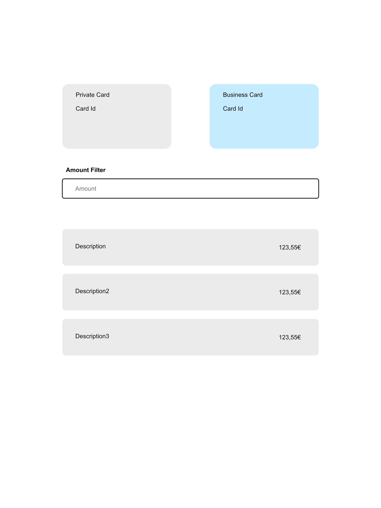

# Cards & Transactions Overview – Frontend Exercise

This exercise is a small frontend application that simulates a banking-style overview page.

The goal is to build a page where a user can view payment cards, select one of them, and inspect its transactions. The user must also be able to filter the transactions by amount.

A rough interface sketch is included in the repository to illustrate the intended layout and interaction. The design is only guidance — a pixel-perfect implementation is **not required**.

**Expected time investment:** ~4 hours




## Functional Requirements

### Card Selection

* Display a list of payment cards
* The user can select one of the cards
* The selected card becomes the active context of the page

### Transactions

* When a card is selected, show the transactions belonging to that card
* The transactions should visually relate to the selected card (for example: matching background color or another clear visual connection)

### Filtering

* A numeric filter field must exist between the cards and the transactions list
* The user can enter an amount
* Only transactions with an amount **greater than or equal to** the entered value remain visible
* When the user switches to another card, the filter input resets

## Technical Setup

Use the framework relevant to the role you applied for (e.g. React, Vue, etc.).

You may:

* use the included starter project, or
* create your own setup from scratch

You are free to add any libraries you consider appropriate (state management, routing, testing tools, UI helpers, etc.).

If you use the starter project:

```bash
yarn
```

## Data Source

The repository contains example data inside `src/data` as JSON files.

You may use this data as the backing data for the application.
However, the application should be implemented as if the data were loaded from an external API rather than directly from static imports.

In other words, structure your solution so that replacing the local data with real network requests would not require major changes to the application architecture.

## General Expectations

We are interested in how you approach implementing a feature in a small application.

If you complete the core requirements early, you are welcome to extend the solution further or refine parts of the implementation. Additional improvements are optional and should not be necessary to submit a valid solution.

### Junior

A working implementation that follows the described behavior and is reasonably understandable.

### Mid-Level

A well-structured and maintainable solution with clear organization and thoughtful implementation choices.

### Senior

A solution that reflects engineering maturity and consideration for long-term maintainability and scalability.

## What to Include in Your Submission

Please provide:

* the full source code
* a short `README` explaining:

  * how to run the project
  * assumptions or tradeoffs you made
  * what you would improve with more time

The goal of this exercise is to understand your technical decisions and development approach when implementing a real feature.
